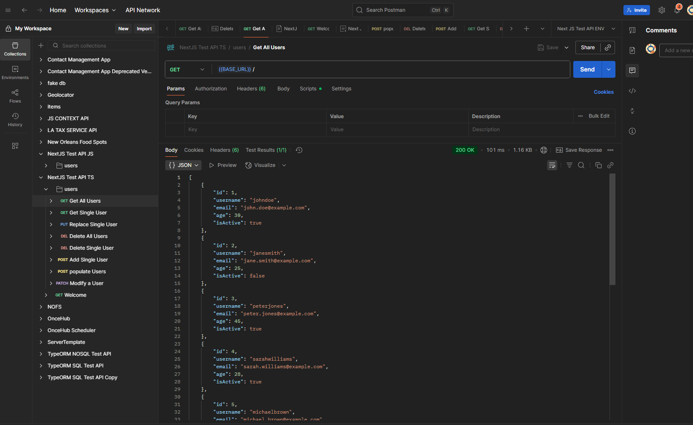
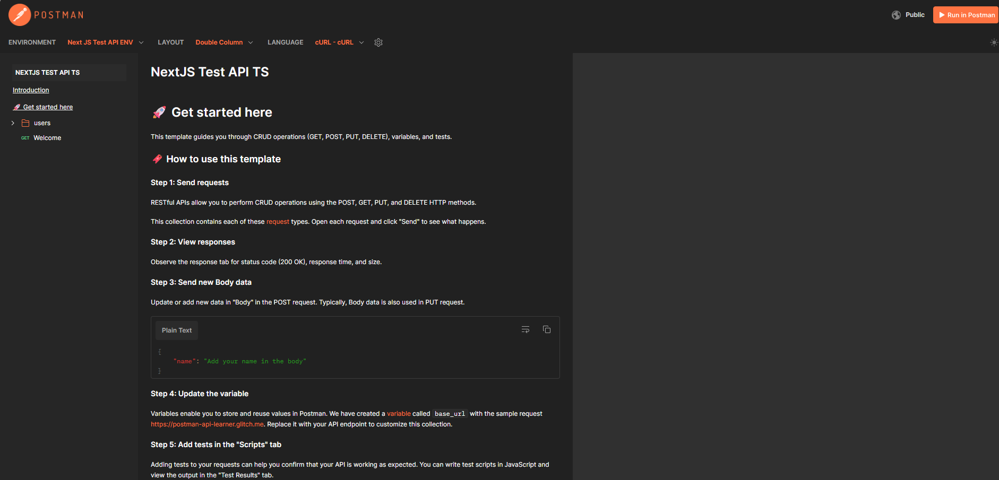
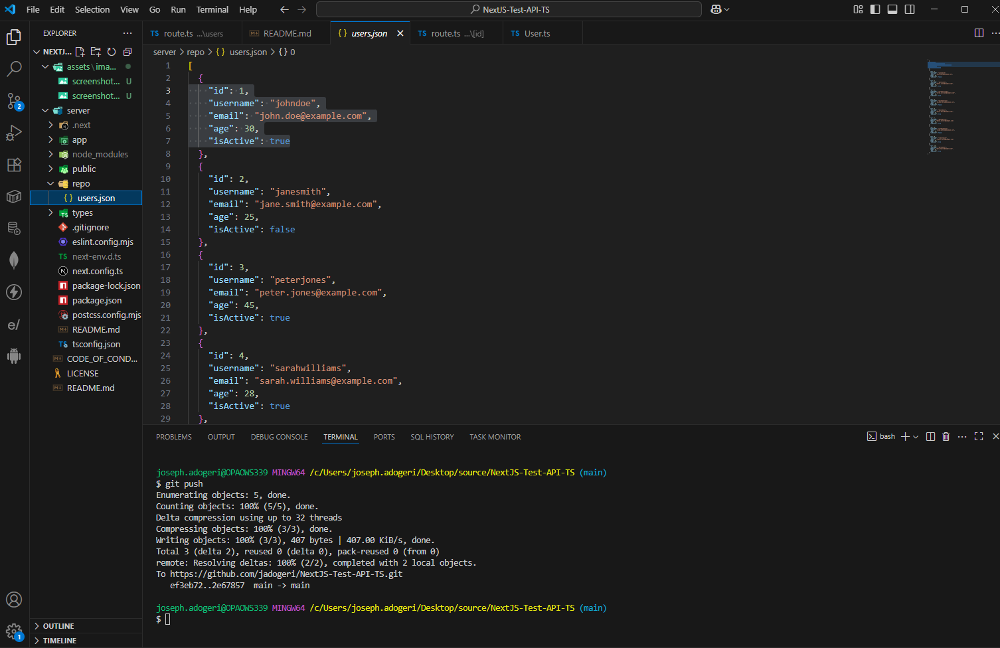
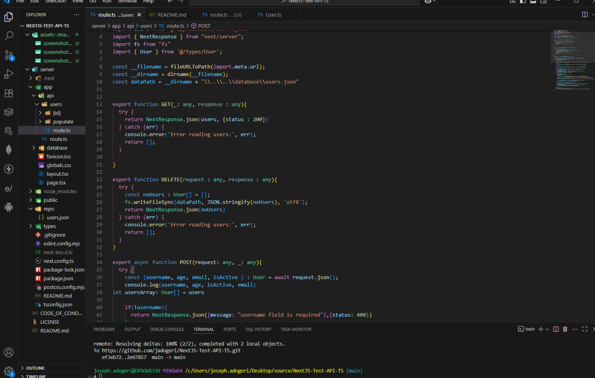

# **NEXTJS TEST API TS**

**Version:** 1.0.1
**Date:** August 15, 2025

---

## Description

This is a nextjs application (typescript) for testing CRUD in frontend or backend applications.

## Authors

[@jadogeri](https://www.github.com/jadogeri)

## Repository

 [https://github.com/jadogeri/NextJS-Test-API-TS.git](https://github.com/jadogeri/NextJS-Test-API-TS.git)


## Screenshots

|  |  |
| -------------------------------------------- | -------------------------------------------- |
|  |  |
|                                              |                                              |

## Table of Contents

<ul>
    <li><a href="#1-introduction">1. Introduction</a>
        <ul>
          <li><a href="#11-purpose">1.1 Purpose</a> </li>
          <li><a href="#12-scope">1.2 Scope</a> </li>
          <li><a href="#13-intended-audience">1.3 Intended Audience</a> </li>
        </ul>
    </li>
    <li><a href="#2-technology-stack">2. Technology Stack</a></li>
    <li><a href="#3-usage">3. Usage</a> </li>
    <li><a href="#4-api-documentation">4. API Documentation</a> </li>
    <li><a href="#5-license">5. License</a> </li>
    <li><a href="#6-references">6. References</a></li>
<ul>

## 1. Introduction

### 1.1 Purpose

This document outlines the package architecture, components, and design considerations for runninr test API. The goal is to create a test API for performing CRUD operations.

### 1.2 Scope

This package will allow users to:

- Performs GET, POST, PUT, PATCH and DELETE requests.
- Allows reset of data(json serving as database objects).

### 1.3 Intended Audience

- Junior or Senior developers.
- Beginners learning typescript.

---

## 2. Technology Stack

- **Programming Languages**: Typescript
- **IDE**: Visual Studio Code (VSCode)
- **Plugins**: Early AI
- **Source Control**: Git and GitHub
- **Code Analysis**: SonarQube
- **API Testing**: Postman

---

## 3. Usage

1 Open up a terminal, type git clone https://github.com/jadogeri/NextJS-Test-API-TS.git to download project.

```bash
  git clone https://github.com/jadogeri/NextJS-Test-API-TS.git
```

2 Type cd NextJS-Test-API-TS/server to enter project root directory.

```bash
  cd NextJS-Test-API-TS/server
```
3 Type npm install command for installing project dependencies.

```bash
  npm install
```
4 Type npm run dev to run application in development mode.

```bash
  npm run dev
```

## 4. API Documentation

Utilize the documentation below for testing frontend or backend application.

## [API Documentation](https://documenter.getpostman.com/view/40822092/2sB3BHkTqw)

## 5. License

[LICENSE](/LICENSE)

---

## 6. References

* FreeCodeCamp : [Frontend Web Development: (HTML, CSS, JavaScript, TypeScript, React)](https://www.youtube.com/watch?v=MsnQ5uepIa).
* AweSome Open Source : [Awesome Readme Templates](https://awesomeopensource.com/project/elangosundar/awesome-README-templates)
* Readme.so : [The easiest way to create a README](https://readme.so/)

